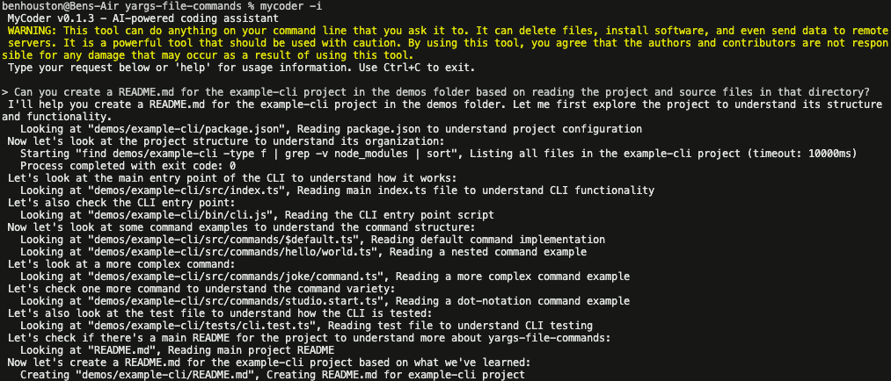

# MyCoder

[![NPM Package][npm]][npm-url]
[![NPM Downloads][npm-downloads]][npmtrends-url]
[![CI Status][ci]][ci-url]
[![Discord][discord]][discord-url]

## Overview

MyCoder is a simple to install, powerful command-line based AI agent system that can perform arbitrary tasks with a particular focus on coding tasks. It uses a modular tool-based architecture that allows it to interact with files, execute commands, make network requests, and spawn sub-agents for parallel task execution.

Please join the MyCoder.ai discord for support: https://discord.gg/5K6TYrHGHt



## WARNING and LIABILITY WAIVER

This tool can do anything on your command line that you ask it to. It can delete files, install software, and even send data to remote servers. It is a powerful tool that should be used with caution. By using this tool, you agree that the authors and contributors are not responsible for any damage that may occur as a result of using this tool.

## API Key Required

Before using MyCoder, you must have an ANTHROPIC_API_KEY specified either:

- As an environment variable, "export ANTHROPIC_API_KEY=[your-api-key]" or
- In a .env file in the folder you run `mycoder` from

Get an API key from https://www.anthropic.com/api

## Quick Start

```bash
# Install globally
npm install -g mycoder

# Start MyCoder with a prompt
mycoder "fix all build errors and ensure the tests pass"

# Start in interactive mode
mycoder -i

# Read prompt from a file
mycoder --promptFile=your-prompt.txt
```

## Key Features

- 🤖 **AI-Powered**: Leverages Anthropic's Claude API for intelligent decision making
- 🛠️ **Extensible Tool System**: Modular architecture with various tool categories
- 🔄 **Parallel Execution**: Ability to spawn sub-agents for concurrent task processing
- 📝 **Self-Modification**: Can modify code, it was built and tested by writing itself
- 🔍 **Smart Logging**: Hierarchical, color-coded logging system for clear output
- 👤 **Human Compatible**: Uses README.md, project files and shell commands to build its own context

### CLI Options

- `[prompt]`: Main prompt text (positional argument)
- `-i, --interactive`: Run in interactive mode, asking for prompts
- `-f, --file`: Read prompt from a specified file
- `--log`: Set log level (info, verbose, warn, error)
- `-h, --help`: Show help
- `-V, --version`: Show version

## Available Tools

To list the current tools that the agent makes use of run:

```bash
mycoder tools
```

## Example Use Cases & Prompts

MyCoder excels at various software development tasks. Here are some example prompts and use cases:

### Code Migration & Updates

```bash
# Converting test framework
mycoder "Convert all Jest tests in the src/ directory to Vitest, updating any necessary configuration files and dependencies"

# Dependency updates
mycoder "Update all dependencies to their latest versions, handle any breaking changes, and ensure all tests pass"
```

### Code Refactoring

```bash
# Class refactoring
mycoder "Refactor the UserService class in src/services/UserService.ts to use the repository pattern, update all files that use this class, and ensure tests pass"

# API modernization
mycoder "Convert all callback-based functions in the project to use async/await, update tests accordingly"
```

### Feature Implementation

```bash
# CLI enhancement
mycoder "Add a new global --debug command line option that enables verbose logging throughout the application"

# New functionality
mycoder "Create a new caching system for API responses using Redis, including configuration options and unit tests"
```

### Maintenance & Fixes

```bash
# Build fixes
mycoder "Fix all TypeScript build errors and ensure all tests pass"

# Test coverage
mycoder "Add unit tests for all untested functions in the src/utils directory, aiming for 80% coverage"
```

### Documentation

```bash
# Documentation generation
mycoder "Generate comprehensive JSDoc documentation for all exported functions and update the API documentation in the docs/ directory"

# Architecture documentation
mycoder "Analyze the current codebase and create detailed architecture documentation including component diagrams and data flow"
```

These examples showcase MyCoder's ability to handle complex software development tasks. The tool uses its understanding of software development best practices, project structure, and coding standards to execute these tasks while maintaining code quality and test coverage.

## Technical Requirements

- Node.js >=18.0.0
- npm or pnpm

## Contributing

We welcome contributions! Please see [CONTRIBUTING.md](CONTRIBUTING.md) for our development workflow, coding guidelines, and testing procedures.

## Development Workflow

### Commit Messages

This project uses [Conventional Commits](https://www.conventionalcommits.org/) for commit messages. See [COMMIT_CONVENTION.md](COMMIT_CONVENTION.md) for detailed guidelines.

### CI/CD Pipeline

The project uses GitHub Actions for continuous integration:

- A single CI pipeline automatically builds and tests the code on all branches and pull requests to main

The release process is managed manually using [changesets](https://github.com/changesets/changesets) which:

1. Determines version bumps based on commit messages
2. Generates changelogs

Releases to GitHub and publishing to npm are performed manually after review.

## License

MIT License

[npm]: https://img.shields.io/npm/v/mycoder
[npm-downloads]: https://img.shields.io/npm/dw/mycoder
[npm]: https://img.shields.io/npm/v/mycoder
[npm-url]: https://www.npmjs.com/package/mycoder
[npm-downloads]: https://img.shields.io/npm/dw/mycoder
[npmtrends-url]: https://www.npmtrends.com/mycoder
[ci]: https://img.shields.io/github/checks-status/bhouston/mycoder/main
[ci-url]: https://github.com/bhouston/mycoder/actions
[discord]: https://img.shields.io/discord/1339025847331328000
[discord-url]: https://discord.gg/5K6TYrHGHt
